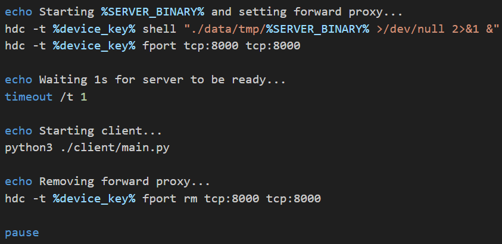

# 小屏变大屏 OHScrcpy
 

## Overview
OHScrcpy is an adaptation of the popular screen mirroring and control tool Scrcpy, tailored specifically for OpenHarmony devices. It enables users to display and control their OpenHarmony devices on a computer with high performance and quality.

## Demo Video
Watch our demo video to see OHScrcpy in action: [Demo Video](https://www.bilibili.com/video/BV1Fk22Y9Etq)  <!-- Add demo video link here -->

## Features
- Low latency streaming (15-20 fps)
- Easy setup and minimal dependencies
- Full touch, scroll, and keyboard input support from the client
- Remote screen resizing directly from the client
- Automatic screen rotation detection on the client side

## Currently Supported and tested
- Openharmony4.02
- Client: Windows11
- Server: DAYU200 device (rk3568 family).


## Components

### Server
- **Socket Management**: Manages socket operations including creating, binding, and listening to establish connections.
- **Display Management**: Interfaces with OpenHarmony’s display system to capture screens.
- **Image Processing**: Converts the captured screen from PixelMap to JPEG format for efficient transmission.
- **Transmission**: Sends the processed JPEG image over the network to the client.

### Client
- **Connection Handling**: Establishes and maintains a connection with the server, managing network issues gracefully.
- **Image Reception**: Receives JPEG images and decodes them for display.
- **Display Rendering**: Displays the received images in a GUI window, updating in sync with the frame rate of the incoming images.
- **FPS Calculation**: Tracks and displays the frames per second (FPS) to provide feedback on streaming performance.

## Installation
1. **Ensure Python 3 is installed** on your computer, as the client application uses PyQt6 for the GUI.
2. **Check if `scrcpyoh_server` binary exists**. If not, see the Build section below.
3. **Connect your device board (RK3568)** to the host machine.

## Build
If the existing binary is not working for you, it might be source code inconsistency. You are recommended to build the tool on your openHarmony source code using this steps:
1) Ensure your development environment is set up for OpenHarmony, for details, please refer to the official documentation
2) Copy the server directory under the foundation/window/window_manager/ and rename it to scrcpyoh;
3) Modify foundation/window/window_manager/bundle.json and add "//foundation/window/window_manager/scrcpyoh:scrcpyoh_server" to the "base_group" list, as follows:
    ```json
    "base_group": [
    "//foundation/window/window_manager/snapshot:snapshot_display",
    "//foundation/window/window_manager/interfaces/kits/napi/window_runtime/window_stage_napi:windowstage",
    "//foundation/window/window_manager/interfaces/kits/napi:napi_packages",
    "//foundation/window/window_manager/resources:window_resources",
    "//foundation/window/window_manager/scrcpy:scrcpy_server"
    ]
    ```
4) Compile command (executed in the OpenHarmony root directory):
    ```bash
    ./build.sh --product-name rk3568 --ccache --gn-args enable_notice_collection=false --gn-args load_test_config=false --gn-flags="--export-compile-commands" --target-cpu arm64  --build-target scrcpyoh_server --fast-rebuild
    ```
5) The build binary path will be: `SOURCE_CODE_PATH/out/rk3568/window/window_manager/scrcpyoh_server`
6) Move the file to same folder as `launch.bat` and `client` folder.

If you build it once, you can try fast rebuild
    ```bash
    ./prebuilts/build-tools/linux-x86/bin/ninja  -w dupbuild=warn -C ./out/rk3568  scrcpyoh_server
    ```
## Usage
- **Make sure** you have binary file called `scrcpyoh_server` and `client` folder on the same dictionary as `launch.bat`.
- **Start the server** on your OpenHarmony device by executing the `launch.bat` file. This script checks for the server binary, sets up the device connection, and handles the server launch. You can refer to it for more details. 
    
    You can adjust port number, binary path and python client path accordingly. 

## Acknowledgment
We would like to extend our thanks to [https://gitee.com/cleefun/ohscrcpy](https://gitee.com/cleefun/ohscrcpy) for providing the baseline of our work and giving us inspiration to explore more.
